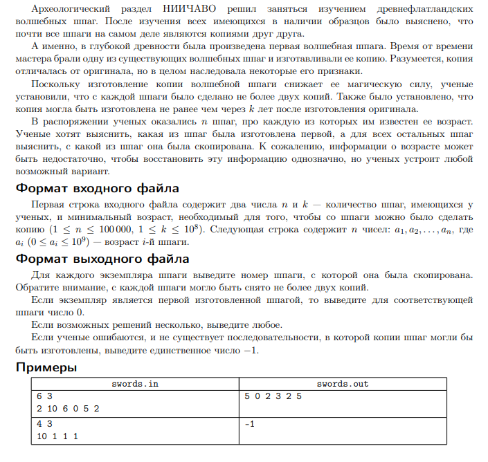

# Exercise 1

Write a function (with tests) `func isHeap(s []int) bool` in the directory `is_heap` that checks if a given
slice represents a heap.

# Exercise 2

Write a program in the directory `swords` that solves the following problem:

